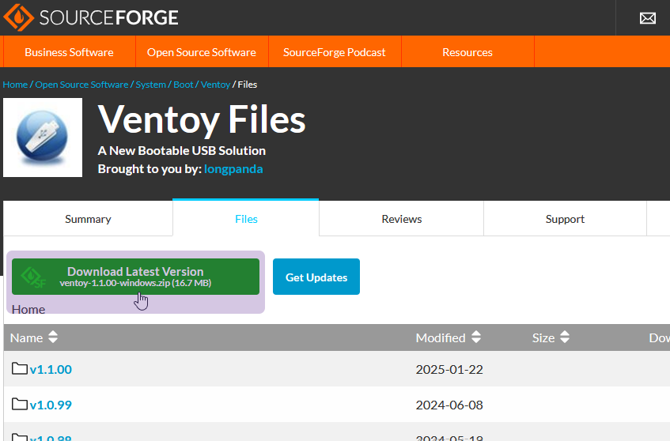

# [SapphireOS](https://github.com/hickerdicker/sapphireos) Install and Configuration Guide
https://www.youtube.com/watch?v=KkfOyqv5FY0
> SapphireOS has been my passion project for the last year and a half and it has taught me a lot about Windows and C# programming whilst also motivating me to get better at tweaking. This is the ultimate in-depth setup guide for it

This is an in-depth guide on how to install and setup SapphireOS. Please read this guide thoroughly as to avoid making any mistakes

# What's the difference between Superlite and Ultralite?
### TL;DR: ➡️ Use Ultralite if you only game, Superlite if you do more than game 😉
The main difference is that Ultralite has even more components removed than Superlite, catering to users who want a lighter ISO and are less concerned about compatibility. **Performance differences are minimal**, though Ultralite may boot slightly faster as it loads fewer files. Both versions include the same system tweaks.

# What's the best Windows version?
### TL;DR: ➡️ Use Windows 11 24H2 😉
**Windows 11 24H2** - This version generally performs the best for AMD processors, but due to internal Windows changes, there is no classic alt-tab and does not support Intel Core Duo processors or older.

**Windows 11 23H2** - This version is more stable than 24H2, notably for Intel processors, but generally performs worse than 24H2.

**Windows Server 2022** - This version is like Windows 10 22H2 but with native support for timer resolution and other Windows 11 features, and a lighter Explorer. However there are lots of driver issues, which may require modded drivers. Generally this version performs worse for AMD processors. Not supported by anticheats such as Faceit.

**Windows 10 22H2** - This version is not recommended to use, and may be discontinued soon. Use this version only if you dislike Windows 11 and are unable to use Server. There is no native timer resolution support and generally performs the worst out of the 4 versions.

# Installing SapphireOS
SapphireOS can be installed via USB or non-USB method.

Before installing, it is recommended you download your LAN/Network driver for quick installing. Refer to [How to download your drivers] for moree information.

## Installing via USB
If your USB is under 16 GB, use Rufus. Otherwise, you may use Ventoy.

### Setting up USB using Rufus
Rufus creates bootable USB drives, which you will use to install SapphireOS.
1. Download the SapphireOS .iso in the Downloads channel
2. Download Rufus https://rufus.ie/en/


- Click the first option (`rufus-*.*.exe`)
4. Run the Rufus .exe, select **No** when prompted to check for updates
5. Click `Show advanced drive properties` and check **List USB Hard Drives**
6. Under `Device`, click and select your USB drive letter/label


7. Leaving every other option default, press **START**
- **🛑 Warning: This will delete ALL data on your USB drive!**
8. In the following pop-up, press **OK**

### Setting up USB using Ventoy
Ventoy allows you to boot multiple images off of one USB drive. This way, you can have multiple versions of Windows, recovery solutions, etc. all in one USB. Ventoy is recommended if your USB is over 16GB.
1. Download the SapphireOS .iso in the Downloads channel
2. Download Ventoy https://sourceforge.net/projects/ventoy/files/



- Click the green button **Download Latest Version** *ventoy-\*.\*.\*\*-windows.zip*
4. Run the Ventoy .zip, open the extracted folder, run `Ventoy2Disk.exe`
5. Under `Device`, click and select your USB drive letter/label


6. Click **Install**
7. After installation of Ventoy is complete, navigate to the newly created Ventoy drive
8. Inside the Ventoy drive, copy the SapphireOS .iso inside.


### Installing
After you have prepared your USB drive for installation, you now need to boot into the USB drive.

You will have to boot into your BIOS and rearrange the boot order to prioritze the USB drive, or directly boot to the USB drive via the boot menu. Afterwards, follow the Windows installer.

## Installing without a USB
TODO...

# Setting up SapphireOS (First time boot)
After installing SapphireOS, it's time to set it up.

## Installing a browser
You can install a browser with SapphireTool
1. Open SapphireTool
- You can open SapphireTool via the shortcut on the desktop, or by navigating to `C:\SapphireTool` and double-clicking `SapphireTool.exe`
2. In SapphireTool, click Downloads, located on near the bottom left of the window.

3. In the Downloads section, click the name of the browser you want to download, e.g Ungoogled Chroimum. You can use the scrollbar on the right to scroll down if needed.

5. After checking the browser you want to download, click Download. A green progress bar will display at the bottom.


6. When the download is completed, a pop-up window will appear inside of SapphireTool. Click Open Folder.
- The Downloads folder is located at `C:\SapphireTool\Downloads`


6. Inside the opened folder, double-click the .exe of the browser you downloaded and proceed with the install instructions.


## Installing drivers
After installing a browser, you can now install the needed drivers for your system. To proceed with this, you need to know the model/manufacturer of your system's motherboard.
### Finding the model/manufacturer
1. Open System Information
- You can do this by either
a. Press `Win + R` and type `msinfo32`, pressing Enter or OK afterwards.
b. Open the Start Menu and type either `System Info` or `msinfo32` and press Enter.
2. Inside the System Information window, look for **BaseBoard Manufacturer** and **BaseBoard Product** and note these down.
- Alternatively, you can also open Command Prompt and enter the following command: `wmic baseboard get Manufacturer,product`
- From the Manufacturer item, we now know the manufacturer of the motherboard. From the Product item, we know the model of the motherboard.


*In this example, the motherboard will be the MSI MPG X570 GAMING EDGE WIFI*

3. Using your browser of choice, search the manufacturer and model of your motherboard (e.g, MSI MPG X570 GAMING EDGE WIFI) along with the word **support**


4. Find the link that is from the manufacturer's website with your motherboard's model in the title. You may have to scroll down the page.
5. On the motherboard's page, make sure you are in the Support section by checking the site's navigation bar and clicking Support


6. Inside of Support, find the Downloads section, select your OS, and download the following:
- LAN drivers
- WiFi drivers if you use WiFi, not Ethernet
- Audio drivers


**Chipset drivers are not recommended to install.**

7. After the downloads are finished, extract each .zip file by right-clicking the file, hovering over the 7-Zip option, and selecting Extract Here


8. Inside the extracted folder(s), look for `setup.exe` or anything that indicates an installer and run it. Follow the installer. Do not reboot yet.


## Installing and manually debloating GPU driver
Note down what GPU you have before proceeding. Do not download the automated installers if you plan to debloat your drivers.

### AMD
1. Download drivers https://www.amd.com/en/support/download/drivers.html
- Under **Search or Browse Drivers and Support by Product**, type in your GPU name, then select it and click Search
- Click your OS version, then download **AMD Software: Adrenalin Edition**
2. After downloading, right click the .exe and extract with 7-Zip.
3. Create new folder **outside** of the extracted folder (on your desktop for example), and give it a name, for example AMD Driver.
4. In the extracted driver folder, navigate to `Packages\Drivers\Display\WT6A_INF\` and cut the following files in to the outside created folder:
- ***.cat
- ***.inf
- Random string folder (B406619 for example)
5. In the outside folder, right click the .inf and click **Install**
- **Warning**: If you are using Server, the installation will fail. Please refer to the next section on installing on Server
* * *
#### For Server only:
1. Right click the .inf file and open it with Notepad
2. find the `[Manufacturer]` line
3. In this line, select everything past 10 and onward
e.g (bolded) %ATI% = ATI.Mfg, NTamd64.10 **.0.1..16299, ...**
4. With this selected, Use Find and Replace to replace all instances of this string with blank space
5. Find `[ATI.Mfg.NTamd64.10.0.1..16299]`
6. As before, remove everything after the 10, expect the `]` character at the end
(End result: `[ATI.Mfg.NTamd64.10]`)
7. Open Device Manager
- Display adapters > right click Microsoft Basic Display > Properties > Driver > Update Driver > Browse my computer for drivers > Let me pick from a list of available drivers on my computer > Have Disk... > Browse... > Select .inf file from amd driver folder > Select first option (GPU name) > Next > Install this driver software anyway
* * *
6. Now, open the random string folder and run `ccc2_install.exe` to install Adrenalin. This step is optional, but recommended.

* * *
#### If you need audio drivers from the GPU as well:
1. Navigate to `Packages\Drivers\Audio\`
Select `I2STDM`, `ACPBus2`, `ACPBus`, `ACPAfd`, and cut them into the outside folder.
2. Install each .inf file in each folder
- for Server, you may have to modify .inf file as before
* * *

### NVIDIA
1. Download drivers https://www.nvidia.com/en-us/drivers/
- Under **Manual Driver Search**, type in your GPU name and operating system, then select it, then click Find
- Under **Game Ready Driver**, click View, then Download
- You can also download older versions, but latest is recommended
- Studio drivers are worse for games
2. After downloading, right click the .exe and extract with 7-Zip
3. Inside the extracted folder, select any item inside, then press `Ctrl + A` to select all, then while holding `Ctrl` - Click to deselect the following:
- `setup.cfg`,
- `setup.exe`,
- `NVI2`,
- `Display.Driver`
4. Delete the rest that are selected
5. Right click `setup.cfg` and open with Notepad
6. Scroll down until you find `<file name="...`
- Remove the following lines that contain:
- EulaHtmlFile
- FunctionalConsentFile
- PrivacyPolicyFile
- Save and close
7. Open `NVI2`, and open `presentations.cfg` with Notepad
- Remove the following lines with `<string name=...`
- ProgressPresentationUrl
- ProgressPresentationSelectedPackageUrl
8. Run `setup.exe`, keep Express ticked

## Configuring SapphireTool (free)
Following are the reccomendations for SapphireTool's configuration:
### Tweaks
- **Disable WiFi** - Tick if you don't use WiFi or Spotify
- **Intel TSX** - Tick if on 9th gen Intel or older processor
- **Clipboard** - Tick if you want the Win + Shift + S clipboard. When disabled, you are still able to copy, cut, and paste as normal
- **Serialize Timer Expiration** is not recommended to tick
- **HAGS** - Requires testing for your system and games, generally better ticked on for DX12+ games
- **Classic Alt-Tab** - Visual preference - broken on 24H2 as it cannot switch into fullscreen apps
- **Disable Bluetooth** - Tick this if you do not use Bluetooth
- **BootMenuPolicy Standard** - Ticking this uses modern boot menu instead of legacy
- **Disable VPN** - Tick this if you do not use VPNs, but it doesn't effect PIA
- **Disable NTFS encryption** - Do not tick if you use Microsoft Store
- **Disable FSO and Gamebar** - Untick on 24H2, test on other versions
- **CDROM** - Tick if you're running on a VM for guest tools, or using a disk drive
- **Disable Prefetch** - Untick this if you are using a HDD as a boot drive
- **Disable Print Spooler** - Untick this if you use printers
- **NoLazyMode** - Recommended to tick. Helps timer resolution, but can cause instability in `powercfg /energy` - test the command to see if more errors appear with it on
- **UAC For Admin Account** - Ticking enables UAC for default Sapphire account
- **User Account Control** - Ticking enables UAC for other accounts
- **Disable Startmenu** - Tick if you use a Startmenu replacement such as Open-Shell, StartAllBack, etc.
- **Disable Multi-Plane Overlay** - Unticked is usually better on 24H2, may have to disable for older versions
- **Disable Lock Screen** - Ticking this makes the lock screen black
- **Disable Threaded DPCs** - Recommended to not tick, can increase system latency resulting in worse performance
- **LargeSystemCache** - Keep unticked. Generally placebo, but works on Server
- **System Profile Tweaks** - Tick for better performance
- **NVME Tweaks** - Tick if using NVME drive

### Gaming Tweaks:
- **Disabling Preemption** can cause worse performance. Keep it enabled if you do not plan to test
- **Disable HDCP** - Instead, go into the PostInstall folder and run `!Disable HDCP.bat`. This will break copyrighted content like Disney+, Netflix, etc.
- **Network Optimizations** - click this **after you installed your network drivers**, or if you reinstalled them.
- **Services**: Changing services can give better performance or better compatibility depending on your needs. A restart is required to fully apply the changes.
- **Minimal** - best performance, worse compatibility
- **SapphireOS** - blend between performance and compatibility
- **Default** - best compatibility, worse performance
- **SvcHostSplitThreshold** - Click on the amount of RAM you have. Revert if you use Xbox services or Xbox gamepass. Set to FFFFFF (in PostInstall folder) if you have over 32GB of RAM
- **Win32 Priority Separation** - Recommendation is 26 Hex. 24 and 2A are good as well

### Nvidia GPU Tweaks:
- **NIP** - Applies performance profile
- **P-State 0** - Causes higher power draw and temperature, but better performance
- **Disable ECC** - Increases performance
- **Disable Telemetry** if you do not use the GeForce app
- **Unrestrict Clock Policy** - May improve performance by potentially fixing thermal downclocking, but can lower the card's lifespan if cooling is inadequate.
- **Miscellaneous** tweaks for better performance

### AMD GPU Tweaks:
- **DWORDS** - Applies registry keys for better performance
- **Shader Cache AlwaysON** - Keeps the shader cache enabled for better performance
- **Disable DXNAVI** if you are on an older driver, for Navi GPUs

### Useful Tools:
- **Autoruns** - Disable startup items (updaters, GPIO controller)
- **Devmanview** - Disable devices (GS wave table, HDMI audio...)
- **Serviwin** - Disable services (advanced tool)
- **InSpectre** - For older than 10th gen Intel CPU, Ryzen 3000 or older
- **MouseTester** - Test polling rate stability
- **NSudo** - Run apps as TrustedInstaller with all privileges
- **CRU** - Set to exact refresh (exact reduced option), overclock monitor
- **AUTO DSCP** - Set DSCP for games, lower pings
- **MSI UTil** - Set drivers to MSI - can cause issues if set for audio and sata (bsod, audio crackling) - do not set gpu to high priority, keep undefined
- **DISM++** - Clean caches, DISM w/ GUI
- **Dev.** - Cleanup devices
- **Interrupt AFPT** - Set affinities for devices
- **HIDUSB** - use postinstall folder. Improve polling rate stability on mice with 1-2khz
- **MeasureSleep** - check timer resolution and delta from 1ms
- **Process Explorer** - Task Manager alt - show Context Switch Delta and CPU Cycles Delta
- **ReservedCPUSets** - Reserve cores for affinities (setting for lower latency). May cause cores not to be used by games.
- **DMA Remapping** - PostInstall > Others - Disables DMA Remapping

After installing your drivers and applying tweaks, please reboot your machine.

# Advanced Tweaks
#### ⚠️ **CAUTION: THESE TWEAKS ARE FOR ADVANCED USERS ONLY. DO NOT USE IF YOU ARE UNABLE TO RISK DAMAGING HARDWARE.**
## Micro-adjusting timer resolution
The default timer resolution value in SapphireOS is .507 ms. It is possible to further fine-tune this value for your system by following the process below. Keep in mind that this process may take a long time to complete.

### Finding stable timer resolution
Finding a stable timer resolution involves running a stress test while measuring the current timer resolution. The reccomended stress test is CPU-Z. Tests like Prime95, Linpack Xtreme, etc. may also be used, especially regarding accuarcy, but these tests put an unrealistic load onto the CPU compared to CPU-Z.

1. Download [CPU-Z](https://cpuid.com/softwares/cpu-z.html) and [MicroAdjust](https://github.com/HickerDicker/microadjust/releases/download/release/MicroAdjust.exe)
2. Open MicroAdjust and CPU-Z
3. In CPU-Z, click the **Bench** tab, then click **Stress CPU**
4. While the CPU stress test is running, go to the MicroAdjust window. Enter the values you wish to use, or keep default. Press start
- `start`: starting resolution value
- `end`: ending resolution value
- `increment`: amount resolution increases each test (5: 5000, 5005, ...)
- `samples`: amount of tests ran for each increment
- Lower the increment value and increase the amount of samples for more accurate testing (will take longer).
- Default values: `5000` `5100` `5` `50`
- Using default values, the testing will take between 5-15 minutes to finish.
5. After starting the test, wait and do not use your computer. When the test is finished, you will be notified that `results.txt` was created.
- After the test is finished, in CPU-Z, press **Stop** and close.
6. Navigate to `C:\TimerRes`
7. You can either look for the proper value manually in `results.txt` or graph the results. If you have many samples, you may want to graph the results instead.
Using `results.txt`:
- Find the line with the lowest **Max** value
To graph the results:
- Open the site: https://chart-studio.plotly.com/create/#/
- Press **Import** and upload `results.txt`
- Press **Trace**
- Set **Type** to Line, **X** to RequestedResolutionMs, **Y** to DeltaMs
- Search for the lowest number (first number). Copy this number.

### Setting timer resolution
You can apply the timer resolution via `shell:startup` or using the registry.

Using `shell:startup`:
1. Navigate to `C:\TimerRes` and right-click `SetTimerResolution.exe` and click **Create Shortcut**
- Rename the shortcut to `SetTimerResolution.exe` if not already named
2. Right-click the created shortcut and select **Properties**
- Set **Target** to `C:\TimerRes\SetTimerResolution.exe --resolution #### --no-console`, replacing #### with the value previously found, e.g 5070 (0.507ms)
3. Press `Win + R` and enter `shell:startup`
4. Drag and drop your created shortcut into the opened folder. Replace or delete the old `SetTimerResolution.exe` shortcut if it exists
- At this point you may sign in and out of Windows or restart. If you wish to avoid doing this, follow the next steps
5. Open Task Manager and find the `SetTimerResolution` background process. Right-click and click **End task**
6. Launch the new shortcut. Alternatively, you may sign in and out of Windows or restart

Using the registry:
1. Press `Win + R` and enter `shell:startup`
- Inside the opened folder, delete the `SetTimerResolution.exe` shortcut if it exists
2. Open Command Prompt and enter the following command:
`reg add "HKEY_LOCAL_MACHINE\SOFTWARE\Microsoft\Windows\CurrentVersion\Run" /v "TimerResolution" /t REG_SZ /d "C:\TimerRes\SetTimerResolution.exe --resolution #### --no-console" /f`
- Replace #### with the value previously found, e.g 5070 (0.507ms)
- At this point you may sign in and out of Windows or restart. If you wish to avoid doing this, follow the next steps
3. Open Task Manager and find the `SetTimerResolution` background process. Right-click and click **End task**
4. Launch `SetTimerResolution.exe` with the following parameters: `--resolution #### --no-console`, otherwise sign in and out of Windows or restart

## XHCI-IMOD Setup
*Requires VulnerableDriverBlocklistEnable*
This tweak may help with input.

1. Install RWEverything
2. Move `XHCI-IMOD.ps1` to `C:\XHCI-IMOD`
3. Open Command Prompt and enter the following command:
`reg add "HKEY_LOCAL_MACHINE\SOFTWARE\Microsoft\Windows\CurrentVersion\Run" /v "XHCI-IMOD" /t REG_SZ /d "cmd.exe /c powershell C:\XHCI-IMOD\XHCI-IMOD.ps1" /f`
4. Restart PC

## Disabling Device Manager Devices
You can disable unnecessary devices with the following commands using DevManView:
```
devmanview.exe /disable "Microsoft Device Association Root Enumerator"
devmanview.exe /disable "Microsoft Radio Device Enumeration Bus"
devmanview.exe /disable "Numeric Data Processor"
devmanview.exe /disable "High Precision Event Timer"
devmanview.exe /disable "Microsoft GS Wavetable Synth"
devmanview.exe /disable "Microsoft RRAS Root Enumerator"
devmanview.exe /disable "Intel Management Engine"
devmanview.exe /disable "Intel Management Engine Interface"
devmanview.exe /disable "Intel SMBus"
devmanview.exe /disable "SM Bus Controller"
devmanview.exe /disable "Amdlog"
devmanview.exe /disable "AMD PSP"
devmanview.exe /disable "System Speaker"
devmanview.exe /disable "Composite Bus Enumerator"
devmanview.exe /disable "Microsoft Virtual Drive Enumerator"
devmanview.exe /disable "Microsoft Hyper-V Virtualization Infrastructure Driver"
devmanview.exe /disable "NDIS Virtual Network Adapter Enumerator"
devmanview.exe /disable "Remote Desktop Device Redirector Bus"
devmanview.exe /disable "UMBus Root Bus Enumerator"
devmanview.exe /disable "WAN Miniport (IP)"
devmanview.exe /disable "WAN Miniport (IKEv2)"
devmanview.exe /disable "WAN Miniport (IPv6)"
devmanview.exe /disable "WAN Miniport (L2TP)"
devmanview.exe /disable "WAN Miniport (PPPOE)"
devmanview.exe /disable "WAN Miniport (PPTP)"
devmanview.exe /disable "WAN Miniport (SSTP)"
devmanview.exe /disable "WAN Miniport (Network Monitor)"
:: devmanview.exe /disable "High Definition Audio Controller" :: Uncomment if you do not use motherboard audio
devmanview.exe /disable "Root Print Queue"
devmanview.exe /disable "PCI Encryption/Decryption Controller"
devmanview.exe /disable "PCI Memory Controller"
devmanview.exe /disable "PCI standard RAM Controller"
devmanview.exe /disable "System Timer"
devmanview.exe /disable "Programmable Interrupt Controller"
devmanview.exe /disable "Communications Port (COM1)"
devmanview.exe /disable "Fax"
devmanview.exe /disable "Microsoft Print to PDF"
devmanview.exe /disable "Microsoft XPS Document Writer"
```

## BIOS Configuration
This section is not finished.
#### 🛑 **WARNING: IMPROPER BIOS CONFIGURATION MAY RESULT IN PERMANENT DAMAGE TO HARDWARE.**
#### If you want this process automated, along with exclusive tweaks, see What next?
Your BIOS can be configured to improve latency and performance. We will separate BIOS configuration into 2 categories:
### Visible
Visible settings are what is typically accessible via the BIOS menu.
Visible settings typically relate to overclocking, power-saving features, and disabling unused features. We will not focus on overclocking in this section.

**Disable Unnecessary Devices**
Generally, you can follow the rule of "If you're not using it, disable it".
Look to disable the following if you do not use it:
- WLAN, Wi-Fi
- Bluetooth
- High Definition Audio Controller (do not disable if you use motherboard audio)
- Integrated graphics (iGPU)
- Unused SATA ports, RAM slots

**Resizable Bar (ReBAR)**
Enabling ReBAR generally improves performance, but may introduce performance regressions in some games. Enabling ReBAR requires you to set GPT/UEFI mode and enable Above 4G Decoding in BIOS.
You can check ReBAR status with GPU-Z.
If your motherboard does not support enabling ReBAR unsupported motherboards, consider viewing ReBarUEFI/NvStrapsReBar.

**Hyperthreading/Simultaneous Multithreading**
If you have enough cores for the games you play (generally 8+ cores) then consider disabling HT/SMT. This feature is beneficial for highly threaded operations such as encoding, compiling, and rendering, however using multiple execution threads per core can increase latency and jitter. Disabling also increases overclocking potential with lower temperatures.
In most cases, you should test if this makes your games perform better. The potential latency reduction is not worth it for worse performance.

**Virtualization/SVM Mode**
Virtualization should be disabled if not needed as it can create memory latency. You can verify if it is enabled via Task Manager or System Information.

**Trusted Platform Module (TPM)**
**⚠️ Disabling TPM will negatively impact security and expose the system to vulnerabilities. Please evaluate the risks involved with disabling TPM**

TPM enabled can cause the system to enter System Management Mode via System Management Interrupts which can cause the CPU to suspend all other activities, which can introduce latency. Some anticheats require TPM to be enabled.
You can verify if TPM is enabled by pressing `Win + R`, then entering `tpm.msc`

**Secure Boot**
**⚠️ Disabling Secure Boot will negatively impact security and expose the system to vulnerabilities. Please evaluate the risks involved with disabling Secure Boot**
Some anticheats require Secure Boot to be enabled. If Secure Boot is not required, it can be disabled to avoid various issues. You can verify if it is enabled by viewing System Information.

**Compatibility Support Module (CSM)**
If you are using MBR/Legacy instead of GPT/UEFI, CSM will be enabled. Typically, only the storage and PCIe OpROMs are required, but you can enable all of them if you are unsure.
Disable CSM if you are using GPT/UEFI and/or ReBAR.

**Fast Startup**
It is recommended to disable Fast Startup as it can lead to unexpected issues. When disabled, boot times will be slightly slower.

**Spread Spectrum**
Spread Spectrum should be disabled as it ensures BCLK frequency is matching the desired value (default is 100MHz, with SS on, it will default to ~99.97MHz)

**Legacy USB Support**
Legacy USB Support may cause the system to enter System Management Mode via System Management Interrupts which cause the CPU to suspend all other activities, potentially increasing latency. You may need to turn this on to install a new operating system or access certain USB devices in some cases.

**Software Installation Options**
Disable any options relating to automatic software installation, such as ASUS Armoury Crate, MSI Center, etc. This is unneeded bloatware and can cause issues.

**PCI Link Speed for Devices**
Set PCIe link speed to the maximum supported such as Gen 4.0 or Gen 5.0. Setting PCIe link speed to Gen 5.0 may cause stability issues on certain GPUs.

**NX**
NX is required to be enabled for some anticheats. NX disabled may cause issues booting into Linux.

*Credit to valleyofdoom*

### Hidden (SCEWIN)
Unfinished...

# Recovering a broken install
It is **HIGHLY** recommended that you have at least 1 USB drive flashed with a stock Windows installer, or have access to another PC.

# What next?
If you want to squeeze the most performance out of your PC, consider purchasing a paid SapphireTool license. SapphireTool offers a wide variety of customization options and performance tweaks to enhance your system, including BIOS tweaks and exclusive tweaks that are not included with SapphireOS. SapphireTool can be ran on any version of Windows, including SapphireOS.
Purchasing SapphireTool also helps support the development of SapphireOS and the developer Hickensa. ❤️

# Further reading
[valleyofdoom's PC-Tuning](https://github.com/valleyofdoom/PC-Tuning)

* * *

[SapphireOS](https://github.com/hickerdicker/sapphireos) is created by [Hickensa](https://github.com/hickerdicker)
